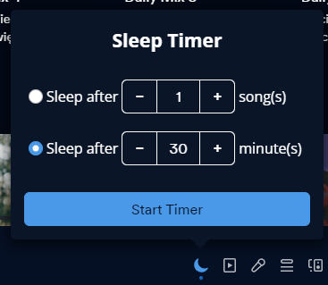
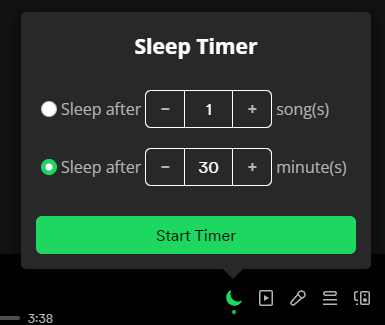

# Sleep Timer Updated

A simple sleep timer extension for Spotify that allows you to set a timer for when you want the music to stop playing.
> Original extension by [Theblockbuster1](https://github.com/Theblockbuster1) can be found [here](https://github.com/Theblockbuster1/spicetify-extensions).

## Contributions

Project is open for contributions. Feel free to open a PR or an issue.

Make sure to leave a star if you like ~~forked from other people~~ my projects.
